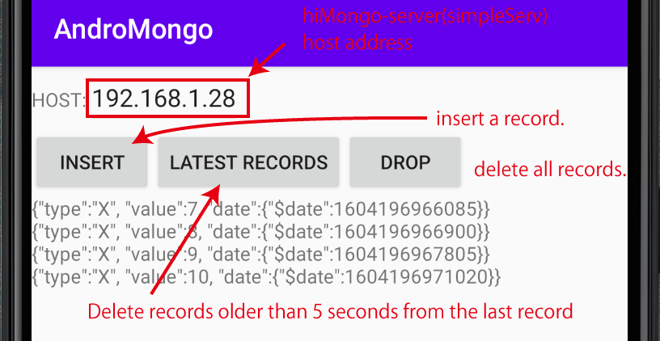

# AndroMongo : hiMongo on Android
### [hiMongo](https://hiuric.github.io/hiMongo/) application sample on Android.

click [this](https://hiuric.github.io/hiMongo/) to see [API](https://hiuric.github.io/hiMongo/)-javadoc.
### AndroidでhiMongoが動きます。
```
class MongoCaller extends AsyncTask<String, Void, String>{
   private MainActivity mActivity;
   public MongoCaller(Activity activity) {
      mActivity =(MainActivity) activity;
      }
   @Override
   protected String doInBackground(String... prm_) {
      StringBuilder         _sb =new StringBuilder();
      hiMonWorkerSample.COM _com=new hiMonWorkerSample.COM(prm_[0],8010,15);
      hiMongo.DB db = hiMongo.use("db01",_com);
      if( prm_[1].equals("drop") ){
         db.in("coll_01").drop();
         }
      else if( prm_[1].equals("insert") ){
         db.in("coll_01")
           .insertOne(prm_[2])
           .find("{}","{_id:0}")
           .sort("{_id:-1}")
           .limit(4)
           .getJsonList(hiU.REVERSE)
           .forEach(Rj->_sb.append(Rj+"\n"))
           ;
         }
      hiU.close(_com);
      return _sb.toString();
      }
   @Override
   protected void onPostExecute(String result_) {
      mActivity.dispResult(result_);
      }
   }
public class MainActivity extends AppCompatActivity{
   int count;
   @Override
   protected void onCreate(Bundle savedInstanceState){
      super.onCreate(savedInstanceState);
      setContentView(R.layout.activity_main);
      findViewById(R.id.drop).setOnClickListener((_View_) ->{
         MongoCaller _mongoCaller = new MongoCaller(this);
         String _host=((EditText)findViewById(R.id.host)).getText().toString();
         _mongoCaller.execute(_host,"drop");
         });
      findViewById(R.id.insert).setOnClickListener((_View_) ->{
         MongoCaller _mongoCaller = new MongoCaller(this);
         String _host=((EditText)findViewById(R.id.host)).getText().toString();
         _mongoCaller.execute(_host,"insert"
               ,"{type:'X',value:"+(++count)+",date:"+hiMongo.date()+"}");
         });
      }
   void dispResult(String result_){
      ((TextView)findViewById(R.id.textView_1)).setText(result_);
      }
   }
```
このサンプルでのWindows/Linux側サーバは[hiMongo](https://github.com/hiuric/hiMongo)のbin/simpleServです。

### Androidの画面は次の様になります。



[API](https://hiuric.github.io/hiMongo/hi/db/hiMonWorkerSample.html)
)
